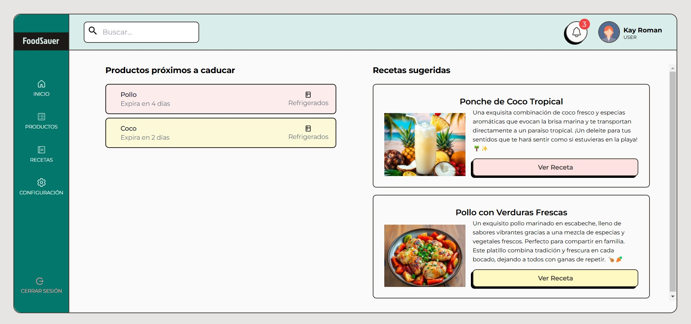

# FoodSaver

**FoodSaver** is a smart, multi-user food inventory app designed to help reduce food waste. Users can track their personal pantry items, receive alerts before food expires, and get delicious recipe suggestions to use up ingredients — all while making sustainable and budget-friendly choices.

 

*A glimpse of the FoodSaver dashboard, where you can manage your inventory, track expiration dates, and discover recipes.*

## Key Features (So far)

* **Personalized Inventories** – Each user gets their own pantry space to track items.

* **Authentication System** – Full user auth flow including sign up, login, and token protection.

* **Inventory CRUD** – Add, edit, delete, and view your own food items.

* **Expiration Alerts** – Get notified about items nearing expiration.

* **Recipe Suggestions** – Discover smart ways to use what you’ve got before it goes bad.

## How FoodSaver Works

FoodSaver combines a user-friendly interface with powerful backend functionality and AI to help you manage your food effectively.

1. **Add your food items:** Easily input your groceries into the system, specifying name, quantity, expiration date, and storage location.
2. **Track expiration dates:** FoodSaver automatically monitors expiration dates and provides timely notifications to prevent food spoilage.
3. **Get recipe recommendations:** The system suggests delicious recipes tailored to your close to expire ingredients.
4. **Reduce waste and save money:** By using what you have and minimizing spoilage, you'll reduce food waste and save money on your grocery bills.

## Project Structure

### Frontend

* **Dashboard:**
    * Role-based access control for Admins and Users.
    * Manage users, food inventory, and recipes in one central location.
* **Landing Page:**
    * Visually appealing design with clear calls to action.
    * Highlights FoodSaver's features and benefits.

### Backend

* **REST API:**  Provides endpoints for managing food items, users, and recipe suggestions.
* **CRUD Operations:**  Supports creating, reading, updating, and deleting data.
* **AI Integration:**  Utilizes AI algorithms to generate personalized recipe recommendations.

## Tech Stack

### Frontend

* React.js
* HTML, CSS, Bootstrap
* Context API for managing global state

### Backend

* Node.js with Express
* Swagger for API documentation
* MongoDB for database management

## Getting Started

### Prerequisites

* Node.js and npm (or yarn) installed
* MongoDB instance running (local or cloud-based)

### API Installation

1. **Clone the repository:**
   ```bash
   git clone [https://github.com/sandyFit/foodSaver.git](https://github.com/sandyFit/foodSaver.git)
   ```
2. **Navigate to the server directory:**
   ```bash
   cd foodsaver/server
   ```
3. **Install dependencies:**
   ```bash
   npm install
   ```
4. **Create a `.env` file in the `server` directory:**
   ```bash
   MONGO_URI=<your_mongodb_connection_string>
   PORT=<your_desired_port> 
   NODE_ENV=development
   JWT_SECRET=<your_secret_key>
   JWT_EXPIRE_TIME=1d 
   COOKIE_EXPIRES_TIME=1 
   ```
5. **Start the development server:**
   ```bash
   npm run dev 
   ```
6. **Access the API documentation:**
   * Open your browser and go to `http://localhost:<your_desired_port>/api-docs`


## Frontend Installation

1. **Navigate to the client directory:**
   ```bash
   cd foodsaver/client
   ```
2. **Install dependencies:**
   ```bash
   npm install
   ```
3. **Start the development client:**
   ```bash
   npm run dev
   ```

## Troubleshooting

* **Problem:**  "Cannot connect to database" error.
    * **Solution:** Ensure your MongoDB instance is running and that the `MONGO_URI` in your `.env` file is correct.
* **Problem:**  Frontend cannot connect to the backend.
    * **Solution:**  Verify that both the frontend and backend servers are running and that the correct port is being used in the frontend's API calls.

## Contact

For questions, feedback, or support, please contact us at [support@foodsaver.com](mailto:trishramos29@gmail.com). 

