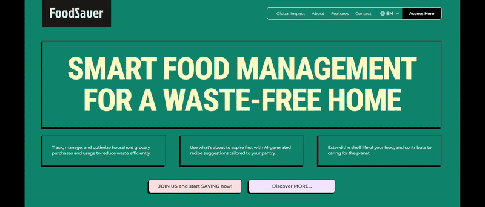
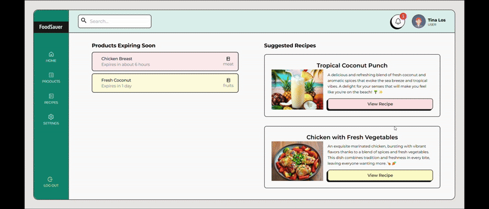

# FoodSaver


**FoodSaver** is a smart, multi-user food inventory app designed to help reduce food waste. Users can manage their personal pantry, get alerts when items are nearing expiration, and discover tasty recipe ideas to make the most of what they have — all while making sustainable and budget-friendly choices.

---

  
*A glimpse of the FoodSaver landing page, featuring a clean interface and Spanish translation.*

---

  
*Explore the FoodSaver dashboard: track your inventory, spot items about to expire, and turn ingredients into meals.*

---


## Key Features (So far)

* **Personalized Inventories** – Each user gets their own pantry space to track items.

* **Authentication System** – Full user auth flow including sign up, login, and token protection.

* **Inventory CRUD** – Users can add, edit, delete, and view food items in their inventory.

* **Expiration Alerts** – Users receive notifications on the home dashboard for close-to-expire items in their inventory.

* **Recipe Suggestions** – Based on available ingredients, users receive smart recipe suggestions to help use items before they expire.

---

## Roadmap

Here’s what’s planned next for future versions of FoodSaver:

### Short-Term Goals (v1.1.x)
- **Google Sign-In** – Simplify access with one-click login.
- **Basic Admin Panel** – Start managing users and monitoring data.
- **Search Function** – Implement autocomplete and keyword search to quickly find items within the inventory.

### Mid-Term Improvements (v1.2+)
- **Inventory Tags & Categories** – Make it easier to sort and filter food items.
- **Changelog / History** – Keep track of updates like item moves or edits.
- **Soft Deletion** – Allow recovery of deleted items (e.g., undo delete).
- **Improved Version Control** – Automate version incrementing for meaningful changes.
- **Enhanced Notification System** – Introduce a centralized notification model with read/dismiss tracking. Expiration checks run in the background, and alerts can be surfaced throughout the app—not just on the dashboard—for better visibility and user engagement.

### Long-Term Vision (v2.0)

#### AI Features
- **AI-Powered Insights** – Analyze food usage and suggest waste-reducing habits.
- **Personalized Menu Planning** – Receive tailored meal suggestions based on preferences and inventory.

#### Collaboration & Accessibility
- **Shared Pantries** – Let households or roommates collaborate on one pantry.
- **Localized Translations** – Expand beyond Spanish and English.

#### Smarter Inputs
- **Item Image Support** – Snap a pic instead of typing item details.
- **Voice or Barcode Entry** – Add food with a quick scan or voice command.


---

## Project Structure

### Frontend

* **Dashboard:**
    * Role-based access control for Admins and Users.
    * Manage users, food inventory, and recipes in one central location.
* **Landing Page:**
    * Visually appealing design with clear calls to action.
    * Highlights FoodSaver's features and benefits.

### Backend

* **REST API:**  Provides endpoints for managing food items, users, and recipe suggestions.
* **CRUD Operations:**  Supports creating, reading, updating, and deleting data.
* **AI Integration:**  Utilizes AI algorithms to generate personalized recipe recommendations.

---

## Tech Stack

### Frontend

* React.js
* HTML5, TailwindCSS
* Context API for managing global state

### Backend

* Node.js with Express
* Swagger for API documentation
* MongoDB for database management

---

## Getting Started

### Prerequisites

* Node.js and npm (or yarn) installed
* MongoDB instance running (local or cloud-based)

### API Installation

1. **Clone the repository:**
   ```bash
   git clone [https://github.com/sandyFit/foodSaver.git](https://github.com/sandyFit/foodSaver.git)
   ```
2. **Navigate to the server directory:**
   ```bash
   cd foodsaver/server
   ```
3. **Install dependencies:**
   ```bash
   npm install
   ```
4. **Create a `.env` file in the `server` directory:**
   ```bash
   MONGO_URI=<your_mongodb_connection_string>
   PORT=<your_desired_port>
   NODE_ENV=development
   JWT_SECRET=<your_secret_key>
   JWT_EXPIRE_TIME=1d
   COOKIE_EXPIRES_TIME=1
   ```
5. **Start the development server:**
   ```bash
   npm run dev
   ```
6. **Access the API documentation:**
   * Open your browser and go to `http://localhost:<your_desired_port>/api-docs`


## Frontend Installation

1. **Navigate to the client directory:**
   ```bash
   cd foodsaver/client
   ```
2. **Install dependencies:**
   ```bash
   npm install
   ```
3. **Start the development client:**
   ```bash
   npm run dev
   ```

## Troubleshooting

* **Problem:**  "Cannot connect to database" error.
    * **Solution:** Ensure your MongoDB instance is running and that the `MONGO_URI` in your `.env` file is correct.
* **Problem:**  Frontend cannot connect to the backend.
    * **Solution:**  Verify that both the frontend and backend servers are running and that the correct port is being used in the frontend's API calls.

## Contact

For questions, feedback, or support, please contact us at [support@foodsaver.com](mailto:trishramos29@gmail.com).

