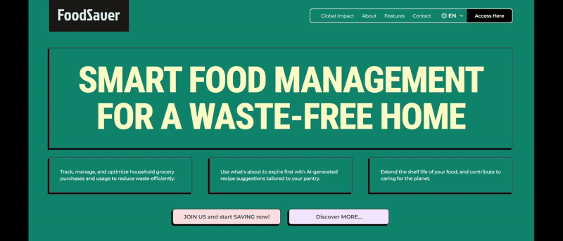
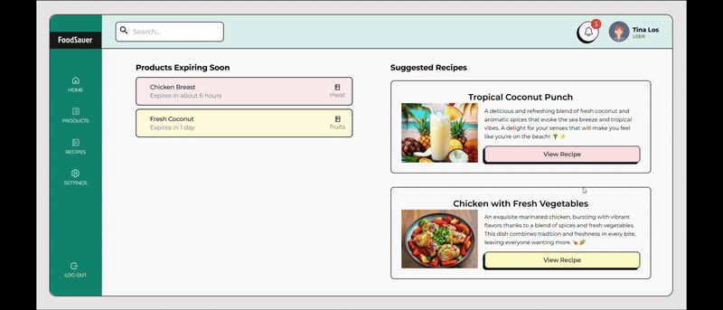

# FoodSaver

A full-stack food management web application built to reduce household food waste. Users track pantry products, receive expiry notifications, and get recipe recommendations based on what they have available.

This repository doubles as a **QA engineering portfolio project** — demonstrating test framework design, requirement traceability, and CI/CD integration.
---

  
*A glimpse of the FoodSaver landing page, featuring a clean interface and Spanish translation.*

---

  
*Explore the FoodSaver dashboard: track your inventory, spot items about to expire, and turn ingredients into meals.*

---


## Table of contents

- [Application overview](#application-overview)
- [Tech stack](#tech-stack)
- [Repository structure](#repository-structure)
- [Getting started](#getting-started)
- [Testing framework](#testing-framework)
- [Documentation](#documentation)


---

# Application Overview

FoodSaver solves a real problem: food goes to waste because people forget what they have and when it expires. The application provides:

| Feature                            | Description                                                                           |
| ---------------------------------- | ------------------------------------------------------------------------------------- |
| **Pantry Tracking**                | Manage food inventory with quantity, unit, and expiration date tracking               |
| **Expiry Notifications**           | Identify products expiring within the next 7 calendar days                            |
| **Recipe Recommendations**         | Generate recipe suggestions based on pantry ingredients                               |
| **Authentication & Authorization** | JWT-based authentication using secure httpOnly cookies with role-based access control |

---

# Project Structure

## Frontend

The frontend provides a responsive user interface for managing inventory, recipes, and account access.

### Dashboard

* Role-based access control for Admin and User accounts
* Food inventory management
* Recipe browsing and recommendations
* User management for administrators

### Landing Page

* Product overview and feature highlights
* Clear onboarding and authentication flows
* Responsive marketing-oriented UI

---

## Backend

The backend exposes a REST API responsible for business logic, authentication, inventory management, and recipe recommendation workflows.

### Core Responsibilities

* RESTful API endpoints
* CRUD operations for users, products, and recipes
* JWT authentication with httpOnly cookies
* Expiration notification logic
* Recipe recommendation integration

---

## Tech stack

### Application

| Layer | Technology |
|---|---|
| Frontend | React 18, Vite |
| Backend | Node.js, Express, TypeScript |
| Database | MongoDB, Mongoose ODM |
| Auth | JWT, bcrypt, httpOnly cookies |
| API documentation | Swagger / OpenAPI (`docs/swaggerDocs.ts`) |

### Testing framework

| Concern | Tool |
|---|---|
| Test runner | Jest 29 + ts-jest |
| HTTP client | Supertest |
| Test database | mongodb-memory-server |
| Contract testing | Pact JS |
| Component mocking | MSW (Mock Service Worker) |
| Data generation | @faker-js/faker |
| CI/CD | GitHub Actions |

---

## Repository structure

```
/
├── client/                        # React 18 frontend
├── server/                        # Express + TypeScript API
│   └── src/
│       ├── routes/
│       ├── controllers/
│       ├── services/
│       └── models/
│
├── tests/
│   ├── api/                       # Jest + Supertest API test suite
│   │   ├── auth/                  # TC-AUTH-001 to TC-AUTH-016
│   │   ├── pantry/                # TC-PAN-001  to TC-PAN-018
│   │   ├── notifications/         # TC-NOT-001  to TC-NOT-009
│   │   ├── recipes/               # TC-REC-001  to TC-REC-008
│   │   ├── contracts/             # Pact consumer contracts
│   │   ├── component/             # Service-layer isolation tests
│   │   ├── helpers/
│   │   │   ├── apiClient.ts       # Cookie-aware Supertest wrapper
│   │   │   ├── authHelper.ts      # Register + login flows
│   │   │   └── dataFactory.ts     # Faker-based test data generators
│   │   ├── setup/
│   │   │   ├── globalSetup.ts     # mongodb-memory-server start
│   │   │   ├── globalTeardown.ts  # mongodb-memory-server stop
│   │   │   └── jest.setup.ts      # Mongoose connect + teardown
│   │   ├── jest.config.ts
│   │   ├── tsconfig.json
│   │   └── package.json
│   │
│   └── e2e/                       # Playwright E2E suite (Phase 2)
│       ├── pages/                 # Page Object Models
│       ├── fixtures/
│       └── specs/
│
├── docs/
│   ├── SRS.md                     # System Requirements Specification
│   ├── BLS.md                     # Business Logic Specification
│   ├── ARCH.md                    # Architecture + data model diagrams
│   ├── TEST-PLAN.md               # Test strategy, scope, sprint plan
│   ├── TEST-COVERAGE.md           # Full test coverage matrix (77 TCs)
│   ├── DEFECT-LOG.md              # Defects found during testing
│   ├── SETUP.md                   # Local development setup guide
│   └── swaggerDocs.ts             # OpenAPI specification
│
└── .github/
    └── workflows/
        └── api-tests.yml          # CI pipeline with coverage gates
```

---

## Getting started

Full setup instructions are in [`docs/SETUP.md`](docs/SETUP.md). Quick start:

```bash
# Clone the repository
git clone https://github.com/sandyFit/foodSaver
cd foodsaver

# Install server dependencies
cd server && npm install

# Install client dependencies
cd ../client && npm install

# Set up environment variables
cp server/.env.example server/.env
# Edit server/.env with your MongoDB URI and JWT secret

# Start the development server
cd ../server && npm run dev

# Start the frontend
cd ../client && npm run dev
```

### Running the test suite

```bash
cd tests/api

# Install test dependencies
npm install

# Run all tests
npm test

# Run a specific domain
npm run test:auth
npm run test:pantry
npm run test:notifications
npm run test:recipes

# Run with coverage report
npm run test:coverage
```

> No external MongoDB instance required — the test suite uses `mongodb-memory-server` which manages its own in-memory database automatically.

---

## Testing framework

### Architecture

The test suite is built around three core abstractions that make 77 test cases maintainable at scale:

**`apiClient.ts`** — A typed Supertest wrapper using `SuperAgentTest` to persist httpOnly cookies across requests. Every test file gets its own client instance with an isolated cookie jar.

**`authHelper.ts`** — Handles register + login flows as reusable setup, so individual tests focus on assertions rather than authentication boilerplate. Supports multi-user scenarios for ownership isolation tests.

**`dataFactory.ts`** — Faker-based generators for all domain entities, with pre-built boundary value helpers for the 7-day notification window. All date comparisons use UTC calendar days to avoid timezone-dependent flakiness (see [DEF-007](docs/DEFECT-LOG.md)).

### Test coverage summary

| Domain | API | Contract | Component | Total |
|---|---|---|---|---|
| Authentication | 16 | 2 | — | 18 |
| Pantry | 18 | 4 | — | 22 |
| Notifications | 9 | 2 | 4 | 15 |
| Recipes | 8 | 2 | 3 | 13 |
| Security | 4 | — | — | 4 |
| Reliability | 3 | — | — | 3 |
| Performance | — | — | — | 2 |
| **Total** | **58** | **10** | **7** | **77** |

Full details including per-test status, linked requirements, and BLS rules in [`docs/TEST-COVERAGE.md`](docs/TEST-COVERAGE.md).

### Test pyramid

```
         /\
        /E2E\          ← Phase 2 (Playwright) — planned
       /------\
      /Contract\       ← 10 tests — response shape agreements (Pact JS)
     /----------\
    / Component  \     ← 7 tests  — service logic in isolation (MSW)
   /--------------\
  /   API tests    \   ← 58 tests — full stack via HTTP (Supertest)
 /------------------\
```

---

## Documentation

All documentation is versioned alongside the code in `/docs`.

| Document | Purpose |
|---|---|
| [`SRS.md`](docs/SRS.md) | System Requirements Specification — 35 requirements across 4 domains, each with acceptance criteria and linked test cases |
| [`BLS.md`](docs/BLS.md) | Business Logic Specification — explicit rules, boundary conditions, and edge cases derived from requirements archaeology |
| [`ARCH.md`](docs/ARCH.md) | Architecture document — component diagram, ERD, auth flow, notification flow, recipe flow, and testing boundary map |
| [`TEST-PLAN.md`](docs/TEST-PLAN.md) | Test strategy, scope, environment, sprint plan, entry/exit criteria, and risk register |
| [`TEST-COVERAGE.md`](docs/TEST-COVERAGE.md) | Full test coverage matrix — every TC mapped to a REQ, BLS rule, type, priority, status, and linked defect |
| [`DEFECT-LOG.md`](docs/DEFECT-LOG.md) | 10 defects found during testing — each with steps to reproduce, root cause, fix status, and regression risk |
| [`SETUP.md`](docs/SETUP.md) | Local development and test environment setup guide |
| [`swaggerDocs.ts`](docs/swaggerDocs.ts) | OpenAPI specification — live API reference |

---


*Test cases are traced to requirements in [`docs/SRS.md`](docs/SRS.md). Business rules are documented in [`docs/BLS.md`](docs/BLS.md).*
