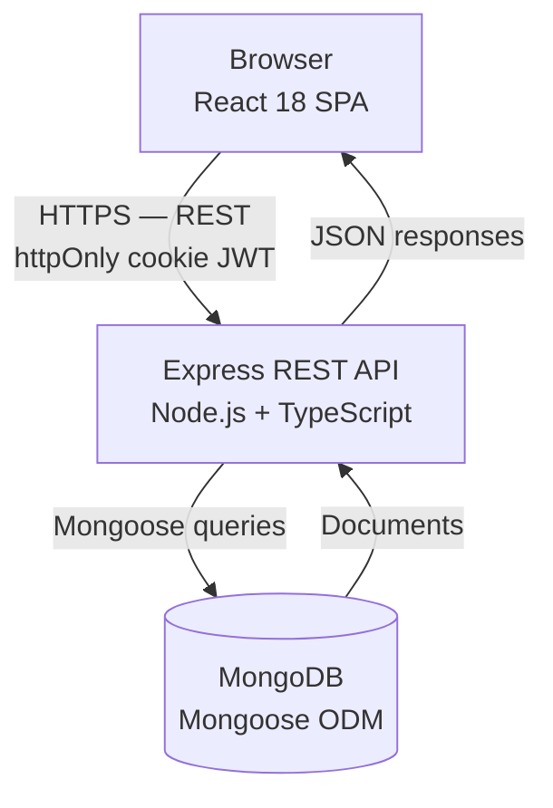
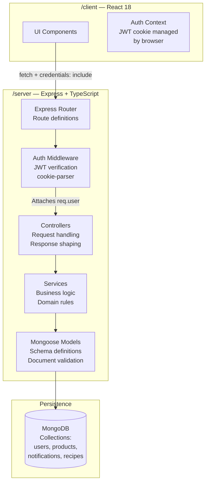
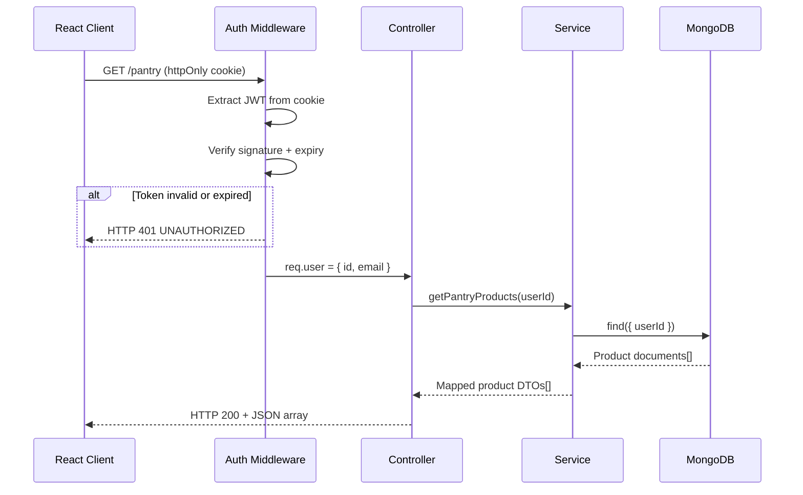
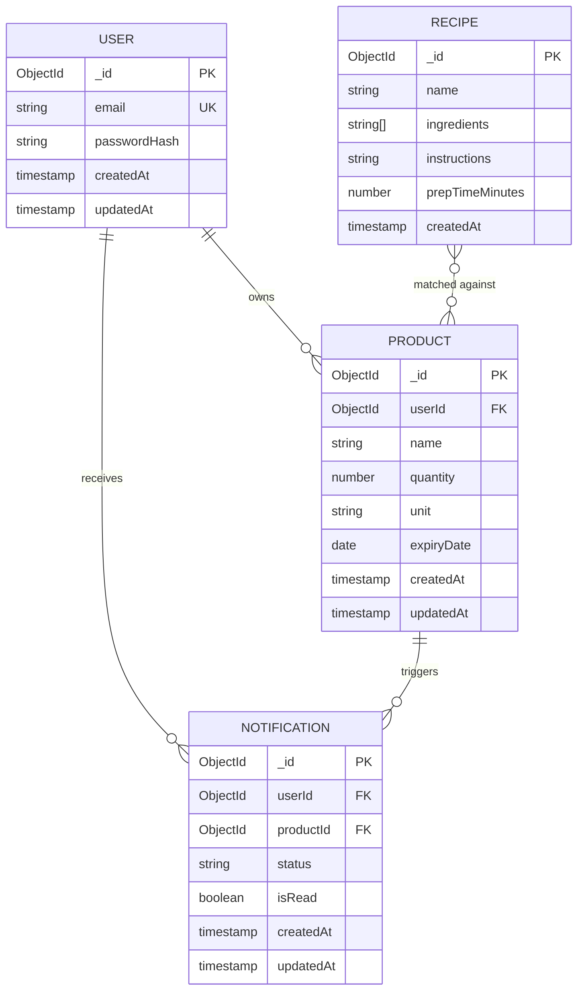

# Architecture document — FoodSaver

**Version:** 1.0.0
**Status:** Draft
**Last updated:** 2026-05-14
**Author:** Trish
**Related documents:** `docs/SRS.md`, `docs/BLS.md`

---

## Purpose

This document describes the system architecture of FoodSaver — its components, data flow, integration boundaries, and data model. It serves as the primary reference for:

- Understanding where integration and contract tests belong
- Identifying which external dependencies should be mocked in component tests
- Planning data integrity assertions in API tests
- Onboarding contributors to the codebase structure

---

## Table of contents

1. [System overview](#1-system-overview)
2. [Component architecture](#2-component-architecture)
3. [Request lifecycle](#3-request-lifecycle)
4. [Data model](#4-data-model)
5. [Authentication flow](#5-authentication-flow)
6. [Notification flow](#6-notification-flow)
7. [Recipe recommendation flow](#7-recipe-recommendation-flow)
8. [Testing boundaries](#8-testing-boundaries)

---

## 1. System overview

FoodSaver is a monorepo full-stack web application composed of two independently runnable packages:

| Package | Technology | Purpose |
|---|---|---|
| `/client` | React 18, Vite | Single-page application — user interface |
| `/server` | Node.js, Express, TypeScript | REST API — business logic and data access |

Persistence is provided by MongoDB Atlas (cloud) or a local MongoDB instance. There are no third-party external services in the current version — all functionality is self-contained.

---

## 2. Component architecture

The server follows a layered architecture with clear separation between routing, business logic, and data access.

### Layer responsibilities

| Layer | Responsibility | Should not |
|---|---|---|
| Router | Define routes, attach middleware | Contain business logic |
| Auth middleware | Verify JWT from cookie, attach `req.user` | Handle business rules |
| Controllers | Parse request, call service, shape response | Query DB directly |
| Services | Apply business rules from BLS | Handle HTTP concerns |
| Models | Define schema, Mongoose validators | Contain business logic |

---

## 3. Request lifecycle

A typical authenticated API request flows through the following stages:

---

## 4. Data model

FoodSaver uses four MongoDB collections. The diagram below shows the document structure and relationships between collections.

### Collection notes

**USER**
- `email` carries a unique index enforced at the MongoDB level
- `passwordHash` is a bcrypt hash — never returned in API responses
- No pantry collection exists — the pantry is the set of products belonging to a user

**PRODUCT**
- `userId` is a required foreign reference to USER `_id`
- `expiryDate` stored as a Date type — comparisons use calendar-day precision per BL-PAN-002
- Deleting a user cascades to products — `Status: TBD` per BLS section 7.2

**NOTIFICATION**
- Created when `GET /notifications` is called and a product enters the 7-day window
- `status` values: `EXPIRING_SOON`, `EXPIRING_TODAY`, `EXPIRED` per BL-NOT-002
- `isRead` is persisted but read/unread tracking is not exposed via the API in this version
- Stale cleanup strategy: `Status: TBD` per BLS section 7.4

**RECIPE**
- `ingredients` is a string array — matching is performed in the service layer, not at the DB level
- Recipe data is static seed data — no create/update/delete endpoints exist in this version
- Minimum 30 recipes required for meaningful test coverage per BL-REC-007

---
